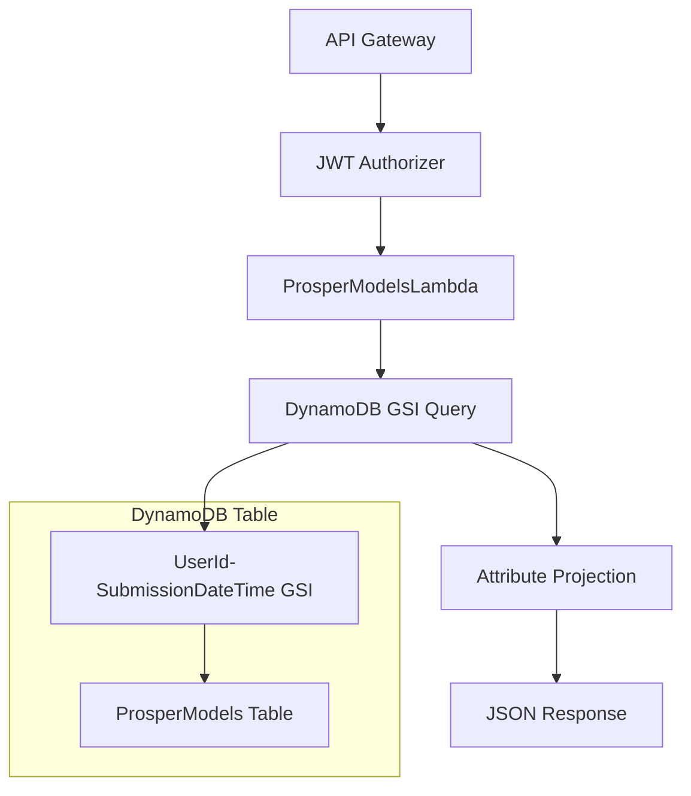

# Design Document

## Overview

This design addresses the incomplete attribute projection in the ProsperModelsApi Lambda function. The current implementation is missing several required attributes and needs to be updated to return the complete set of attributes as specified in the original requirements. The solution involves updating the projection expression, handling DynamoDB reserved words properly, and ensuring backward compatibility with existing API consumers.

## Architecture

The ProsperModelsApi follows a serverless architecture pattern:



The Lambda function queries the DynamoDB table using the Global Secondary Index (GSI) for efficient user-based filtering and returns paginated results with complete attribute sets.

## Components and Interfaces

### ProsperModelsLambda Function

**Current Issues:**
- Missing `FailureStep` attribute in projection
- Inconsistent attribute handling for extended schema
- Potential reserved word conflicts

**Updated Interface:**
```python
def lambda_handler(event, context):
    """
    Query ProsperModels table and return paginated results with complete attributes.
    
    Args:
        event: API Gateway event with query parameters
        context: Lambda context
        
    Returns:
        dict: API Gateway response with items and pagination token
    """
```

### Attribute Projection Configuration

**Complete Attribute Set:**
```python
REQUIRED_ATTRIBUTES = {
    # Core attributes (from updated requirements)
    "Id": "#Id",
    "SubmissionDateTime": "#SDT",
    "ShortDescription": "#ShortDescription",
    "StudyName": "#StudyName",
    "FeatureListName": "#FeatureListName",
    "Label": "#Label",
    "Status": "#Status",           # Reserved word - needs mapping
    "ErrorMessage": "#ErrorMessage",
    "BestCandidateMetrics": "#BestCandidateMetrics",
    "AutoMLJobName": "#AutoMLJobName"
}
```

### DynamoDB Query Configuration

**GSI Query Parameters:**
```python
query_params = {
    "IndexName": GSI_NAME,  # "UserIdDateTime" 
    "KeyConditionExpression": Key("UserId").eq(user_sub),
    "ScanIndexForward": False,  # Newest first
    "Limit": limit,
    "ProjectionExpression": projection_expression,
    "ExpressionAttributeNames": expression_attr_names
}
```

## Data Models

### API Response Model

```python
{
    "items": [
        {
            "Id": "string",
            "SubmissionDateTime": "string",
            "ShortDescription": "string",
            "StudyName": "string",
            "FeatureListName": "string",
            "Label": number,
            "Status": "string",
            "ErrorMessage": "string|null", 
            "BestCandidateMetrics": "string|null",
            "AutoMLJobName": "string|null"
        }
    ],
    "next": "string|null"  # Pagination token
}
```

### DynamoDB Record Model

```python
{
    "Id": {"S": "abc-123-def-456"},
    "SubmissionDateTime": {"S": "2023-12-21T10:30:00Z"},
    "ShortDescription": {"S": "Customer Analysis Model"},
    "StudyName": {"S": "customer-study"},
    "FeatureListName": {"S": "customer-features"},
    "Label": {"N": "42"},
    "Status": {"S": "AutoML_Job_Completed"},
    "ErrorMessage": {"S": null}, # Optional
    "BestCandidateMetrics": {"S": "{'F1': 0.85, 'Accuracy': 0.82}"}, # Optional
    "AutoMLJobName": {"S": "prosper-automl-job-name"}  # Extended
}
```

## Implementation Strategy

### Phase 1: Attribute Mapping Update

1. **Update Expression Attribute Names**
   - Add missing `FailureStep` attribute
   - Ensure all required attributes are mapped
   - Handle DynamoDB reserved words properly

2. **Update Projection Expression**
   - Include all required attributes in projection
   - Maintain backward compatibility with extended attributes

### Phase 2: Error Handling Enhancement

1. **Null Value Handling**
   - Ensure null attributes are included in response
   - Handle missing attributes gracefully

2. **Reserved Word Management**
   - Use ExpressionAttributeNames for all attributes
   - Prevent conflicts with DynamoDB reserved words

### Phase 3: Testing and Validation

1. **Response Validation**
   - Verify all required attributes are present
   - Test with records having missing optional attributes
   - Validate pagination functionality

## Error Handling

### Missing Attribute Handling

```python
def handle_missing_attributes(item):
    """Ensure all required attributes are present in response."""
    required_attrs = [
        "Id", "UserId", "UserName", "SubmissionDateTime",
        "ShortDescription", "FeatureListName", "Label", 
        "Status", "FailureStep", "ErrorMessage", "AUC"
    ]
    
    for attr in required_attrs:
        if attr not in item:
            item[attr] = None
    
    return item
```

### DynamoDB Error Handling

```python
try:
    resp = table.query(**kwargs)
except ClientError as e:
    error_code = e.response['Error']['Code']
    if error_code == 'ValidationException':
        # Handle projection expression errors
        return _response(500, {
            "message": "Invalid attribute projection"
        })
    # Handle other DynamoDB errors
```

## Testing Strategy

### Dual Testing Approach

The testing strategy combines unit tests for specific scenarios with property-based tests for comprehensive validation:

- **Unit tests**: Verify specific examples, edge cases, and error conditions
- **Property tests**: Verify universal properties across all inputs using Hypothesis
- Both approaches are complementary and necessary for comprehensive coverage

### Unit Testing Focus

Unit tests will focus on:
- Specific examples of API responses with known data
- Error conditions (authentication failures, DynamoDB errors)
- Edge cases (empty result sets, malformed pagination tokens)
- Integration points between API Gateway and Lambda

### Property-Based Testing Configuration

Property tests will use the Hypothesis library with:
- Minimum 100 iterations per property test
- Each test tagged with: **Feature: prosper-models-api-completeness, Property {number}: {property_text}**
- Random generation of DynamoDB records with varying attribute sets
- Validation of universal properties across all generated scenarios

### Test Categories

1. **Attribute Completeness Tests**
   - Unit: Test specific known records return expected attributes
   - Property: Generate random records, verify all required attributes present

2. **Null Handling Tests**  
   - Unit: Test records with specific missing attributes
   - Property: Generate records with random missing attributes, verify null handling

3. **Reserved Word Tests**
   - Unit: Test specific queries with "Status" attribute
   - Property: Generate queries with various reserved words, verify success

4. **Pagination Tests**
   - Unit: Test specific pagination scenarios
   - Property: Generate random pagination requests, verify attribute completeness

5. **Backward Compatibility Tests**
   - Unit: Test with known legacy record formats
   - Property: Generate mix of old/new records, verify consistent responses

## Error Handling

### Missing Attribute Handling

```python
def handle_missing_attributes(item):
    """Ensure all required attributes are present in response."""
    required_attrs = [
        "Id", "UserId", "UserName", "SubmissionDateTime",
        "ShortDescription", "FeatureListName", "Label", 
        "Status", "FailureStep", "ErrorMessage", "AUC"
    ]
    
    for attr in required_attrs:
        if attr not in item:
            item[attr] = None
    
    return item
```

### DynamoDB Error Handling

```python
try:
    resp = table.query(**kwargs)
except ClientError as e:
    error_code = e.response['Error']['Code']
    if error_code == 'ValidationException':
        # Handle projection expression errors
        return _response(500, {
            "message": "Invalid attribute projection"
        })
    # Handle other DynamoDB errors
```

### Reserved Word Conflict Resolution

The implementation uses ExpressionAttributeNames to handle DynamoDB reserved words:

```python
expression_attr_names = {
    "#Status": "Status",  # 'Status' is reserved
    "#Id": "Id",
    "#UserId": "UserId",
    # ... other attributes
}
```

## Correctness Properties

*A property is a characteristic or behavior that should hold true across all valid executions of a system-essentially, a formal statement about what the system should do. Properties serve as the bridge between human-readable specifications and machine-verifiable correctness guarantees.*

### Property 1: Required Attribute Completeness
*For any* API response from ProsperModelsApi, every item should contain exactly these attributes: Id, SubmissionDateTime, ShortDescription, StudyName, FeatureListName, Label, Status, ErrorMessage, BestCandidateMetrics, AutoMLJobName
**Validates: Requirements 1.1, 2.1**

### Property 2: Extended Attribute Inclusion  
*For any* DynamoDB record that contains extended attributes (like BestCandidateMetrics), the API response should include those extended attributes in the returned item
**Validates: Requirements 1.2, 2.2, 5.1**

### Property 3: Null Handling Consistency
*For any* DynamoDB record with missing optional attributes, the API response should include those attributes with null values to maintain consistent response structure
**Validates: Requirements 1.3, 3.1, 5.3**

### Property 4: Reserved Word Handling
*For any* DynamoDB query involving reserved words (like "Status"), the query should execute successfully using proper ExpressionAttributeNames mapping
**Validates: Requirements 2.3, 3.3**

### Property 5: Attribute Name Consistency
*For any* API response, the attribute names should match the expected API contract names regardless of DynamoDB internal attribute naming
**Validates: Requirements 2.4**

### Property 6: Pagination with Complete Attributes
*For any* paginated API response, each page should contain items with the complete set of required attributes
**Validates: Requirements 4.3**

### Property 7: Mixed Record Type Consistency
*For any* API response containing records created at different times (with different attribute sets), all items should have the same response structure with consistent attribute presence
**Validates: Requirements 5.4**

### Property-Based Tests

Property-based tests will validate these universal properties across many generated inputs using a Python property testing framework like Hypothesis. Each test will generate random DynamoDB records and API scenarios to verify the properties hold across all valid inputs.